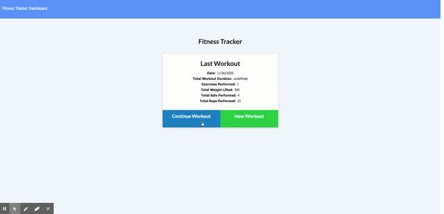

# Workout Tracker

## Description

This repository contains a workout tracker. It uses a MongoDB backend to store and display information about a user's workouts. As of now there is no user authentication, so for the time being this is a proof of concept.

## Table of Contents

[Description](#Description)

[Usage](#Usage)

[Contributing](#Contributing)

[Tests](#Tests)

[Questions](#Questions)

## Usage

To use this app, start at the main page and select if you want to continue the last workout or start a new one. From there you can enter the data of the exercise you performed. Once done you can click on the dashboard tab to see the statistics for the last week.

## Contributing

Contributions are welcome!

## Tests

This project does not currently have any tests.

## Questions

If you have any questions, please contact me at smarten.developer@gmail.com!
